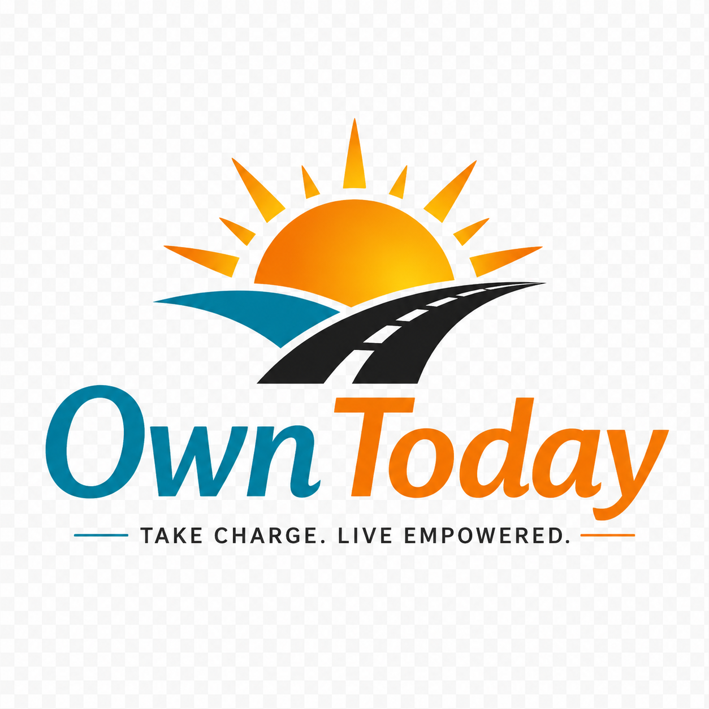

# 🎯 Own Today - White Label Client Engagement Platform

**Take Charge. Live Empowered.**

A comprehensive white-label platform for treatment centers to deploy fully branded client engagement apps with meetings, rewards, progress tracking, and more.



---

## 🆕 Recent Updates (2026-06-11)

✅ **Logo Integration Complete!** - Own Today logo now appears throughout the application:
- ✨ Professional marketing landing page with hero logo
- 🎨 Client portal footer with full branding
- 🛡️ Admin portal hero section with logo
- 🌐 Favicon on all main pages
- 📄 See [LOGO-INTEGRATION-COMPLETE.md](LOGO-INTEGRATION-COMPLETE.md) for details

---

## 🚀 Quick Links

- **📖 [Full Documentation](START-HERE.md)** - Complete getting started guide
- **📊 [Executive Summary](EXECUTIVE-SUMMARY.md)** - High-level overview
- **🎨 [Visual Guide](OWN-TODAY-VISUAL-SUMMARY.md)** - See how it works
- **🛠️ [Setup Guide](README-OWN-TODAY.md)** - Technical setup instructions
- **📅 [Action Plan](NEXT-STEPS-ACTION-PLAN.md)** - What to do next

---

## ✨ Key Features

### For Clients (22 Feature Pages):
- 📍 **Meeting Finder** - Find AA, NA, SMART Recovery, LifeRing, Celebrate Recovery meetings
- ✅ **Check-in System** - QR code and geolocation verification
- 🎁 **Rewards Store** - Earn and redeem points (fully customizable)
- 📊 **Progress Tracking** - Streaks, milestones, achievements
- 📝 **Journaling** - Daily entries with mood tracking
- 🎯 **Goals Management** - Set and track recovery goals
- 🧘 **Meditation Tools** - Guided sessions and timers
- 📚 **Literature Library** - 27 books across 5 recovery programs
- 🔧 **Recovery Toolbox** - 7 essential tools (HALT, SMART, gratitude, etc.)
- 👥 **Alumni Portal** - Post-treatment support and community

### For Organizations (Admin Portal):
- 🎨 **White-Label Branding** - Upload logo, customize colors, org name, tagline
- 📅 **Meeting Management** - Add/edit/delete meetings with geo-fence settings
- 🎁 **Rewards Management** - Create custom rewards, set point values, approve redemptions
- 👥 **User Management** - Add staff, providers, admins with role-based access
- 📊 **At-Risk Reports** - Monitor clients who need support, export CSV reports
- ⚙️ **System Settings** - Configure point values, toggle features, notifications
- 🗺️ **Geo-Fence Control** - Set radius to auto-filter meetings by location
- ⚡ **Self-Service Admin** - Complete control, no developer needed

### For Platform Owner:
- 🏢 **Multi-Tenant** - Unlimited organizations
- 🔒 **Data Isolation** - Complete separation per org
- 🚀 **Quick Deployment** - 4-8 hours per new customer
- 💰 **Recurring Revenue** - SaaS business model
- 🔄 **Easy Updates** - Update once, apply to all

---

## 🌐 Live Demo

**View the landing page**: [Open index.html](index.html)

**Access the platform**:
1. Login Page: [index.html](index.html) - Click "Launch Demo Portal"
2. Client Portal: [client-portal.html](client-portal.html) - 22 feature pages
3. Admin Portal: [admin-portal.html](admin-portal.html) - Complete control center

**Demo credentials**: Any email/password (demo mode enabled)

---

## 📄 All 22 Feature Pages

| # | Page | Purpose | Key Features |
|---|------|---------|--------------|
| 1 | Dashboard | Main hub | Points, streaks, quick actions |
| 2 | Find Meetings | Discover meetings | 5 programs, maps, filters |
| 3 | Meeting Details | View info | Save, directions, details |
| 4 | My Meetings | Saved list | Categories, quick access |
| 5 | Log Meeting | Check-in | +100 points, verification |
| 6 | My Goals | Track goals | Progress bars, milestones |
| 7 | Goal Details | Goal info | Notes, milestones, completion |
| 8 | Daily Journal | Write entries | +50 points, mood tracking |
| 9 | My Rewards | Browse shop | Points redemption |
| 10 | Redeem Reward | Confirm | Point deduction, approval |
| 11 | Meditation | Practice | Timer, breathwork guide |
| 12 | Toolbox | Recovery tools | HALT, SMART, gratitude, etc. |
| 13 | Literature | Book library | 27 books, 5 programs |
| 14 | Book Reader | Read books | Bookmarks, notes |
| 15 | Tablet Check-in | QR scanner | +50 points, confetti |
| 16 | Journal History | Past entries | Search, filters, moods |
| 17 | My Literature | Saved books | Progress tracking |
| 18 | Search | Global search | Cross-feature results |
| 19 | Alumni Portal | Post-treatment | Events, resources |
| 20 | Staff Dashboard | Staff tools | Client management |
| 21 | Provider Dashboard | Clinical tools | Caseload, schedule |
| 22 | **Admin Portal** | **Control center** | **Full customization** |

---

## 🛠️ Tech Stack

- **Frontend**: HTML5, CSS3, JavaScript (ES6+)
- **Database**: Supabase (PostgreSQL)
- **Authentication**: Supabase Auth
- **Styling**: CSS Custom Properties (CSS Variables)
- **Geolocation**: Browser Geolocation API

---

## 🚀 Quick Start

### 1. Set Up Supabase

```bash
# 1. Create account at https://supabase.com
# 2. Create new project
# 3. Run OWN-TODAY-DATABASE-SCHEMA.sql in SQL Editor
# 4. Get API credentials from Settings → API
```

### 2. Configure Credentials

Edit `js/theming-engine.js` and uncomment lines 17-18:

```javascript
SUPABASE_URL = 'https://your-project.supabase.co';
SUPABASE_ANON_KEY = 'your-anon-public-key';
```

### 3. View Locally

Open `index.html` in your browser to see the landing page!

---

## 📖 Documentation

| File | Description |
|------|-------------|
| **START-HERE.md** | Your entry point - read first! |
| **EXECUTIVE-SUMMARY.md** | Business overview |
| **OWN-TODAY-VISUAL-SUMMARY.md** | Visual examples |
| **README-OWN-TODAY.md** | Technical guide |
| **NEXT-STEPS-ACTION-PLAN.md** | Development roadmap |
| **LOGO-INTEGRATION-COMPLETE.md** | Logo integration details (NEW!) |
| **LOGO-LOCATIONS-GUIDE.md** | Visual logo placement guide (NEW!) |

---

## 💰 Business Model

- **Basic**: $299/month (up to 50 clients)
- **Pro**: $599/month (up to 150 clients)  
- **Enterprise**: $999/month (unlimited)

---

## 🎯 Development Status

**Current Phase**: Complete Demo Platform ✅
- ✅ All 22 feature pages complete with demo functionality
- ✅ Admin Portal with full white-label customization
- ✅ 5 recovery programs supported (AA, NA, SMART, LifeRing, Celebrate)
- ✅ Points & rewards system with approval workflow
- ✅ User management (Client, Staff, Provider, Admin roles)
- ✅ Meeting management with geo-fencing
- ✅ At-risk client reports with CSV export
- ✅ Custom branding (logo, colors, organization details)
- ✅ Literature library (27 books across 5 programs)
- ⏳ Ready for database integration (currently demo mode)

---

**Built with ❤️ for the recovery community**

*Take Charge. Live Empowered.*
